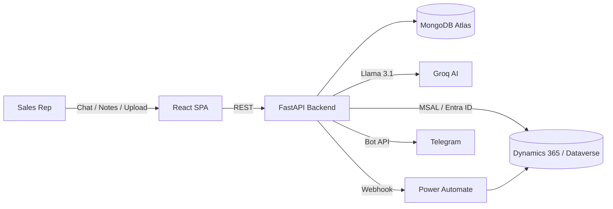

<div align="center">

# Sales Copilot

**An AI copilot that turns CRM logging from a 4-minute chore into a 45-second conversation.**

[](#)
[](#)
[](#)
[](#)
[](#)
[](#)
[](#)
[](#license)

</div>

---

## Overview

Sales Copilot is an AI-native layer over Microsoft Dynamics 365 built for enterprise sales teams. Instead of clicking through CRM forms after every call, reps talk to an AI agent, drop in raw notes, or bulk-upload an account sheet — the copilot handles account matching, activity logging, and CRM write-back in the background.

It's running as a live pilot inside a Fortune 500 sales org, integrated directly into the customer's D365 tenant.

## Features

- 🤖 **Conversational AI agent** — a Groq/Llama-powered chat agent that understands natural-language requests ("log a call with Acme for tomorrow"), holds conversation memory, and triggers real CRM workflows. Every response is grounded in a live snapshot of the app's current state (connected accounts, recent activity, upload status) so answers never hallucinate.
- 📝 **AI notes-to-CRM summarizer** — converts a rep's raw, informal notes into a polished, professional activity record before it's written to D365.
- 🔗 **Direct D365 integration** — activities post straight into the customer's Dataverse via Microsoft Entra ID (MSAL) authenticated Power Automate flows, with a Dataverse REST fallback for broader-permission environments.
- 📊 **Bulk account intelligence** — upload an Excel/CSV account sheet; the copilot auto-detects account columns and fuzzy-matches records against the live account repository.
- ⚙️ **Rule-based bulk activity engine** — define a rule once (activity type, subject/notes template), preview the resulting activities, then execute across every matched account as a trackable background job.
- 📈 **Activities & monitoring dashboards** — success-rate stats, execution history, and admin-level visibility into every workflow that's run.
- 🔔 **Telegram + calendar hooks** — optional Telegram notifications on completed workflows, plus one-click calendar event creation.
- 🔐 **Enterprise auth** — Microsoft SSO (Entra ID) alongside email/password signup, bcrypt-hashed credentials, encrypted token storage, and rate-limited endpoints.
- 🎙️ **Voice Agent** *(in refinement — targeting V3, Sept 2026)* — a call-listening pipeline that transcribes sales calls (STT), extracts a structured PRD/onboarding summary, resolves any newly mentioned account against the account repository by unique ID, and logs the activity straight into D365 with zero manual entry. A placeholder screen for this is already wired into the app.

## Architecture



## Tech stack

| Layer | Stack |
|---|---|
| Frontend | React 19, React Router 7, Tailwind CSS, shadcn/ui (Radix), Framer Motion, Axios |
| Backend | FastAPI, Motor (async MongoDB), Pydantic, slowapi (rate limiting) |
| AI | Groq — Llama 3.1 |
| Auth & Identity | Microsoft Entra ID (MSAL), bcrypt, encrypted session tokens |
| CRM | Microsoft Dynamics 365 (Dataverse REST + Power Automate) |
| Data | MongoDB Atlas, openpyxl / pandas for Excel & CSV processing |
| Deployment | Railway (CI/CD) |

## Getting started

### Prerequisites
- Python 3.11+
- Node.js 18+ and Yarn
- A MongoDB connection string
- Microsoft Entra ID app registration (for D365 SSO)
- A Groq API key

### Backend

```bash
cd backend
python -m venv venv && source venv/bin/activate   # Windows: venv\Scripts\activate
pip install -r requirements.txt
cp .env.example .env   # fill in your own values
uvicorn server:app --reload --port 8000
```

### Frontend

```bash
cd frontend
yarn install
cp .env.example .env   # point REACT_APP_BACKEND_URL at your backend
yarn start
```

The app runs at `http://localhost:3000` and talks to the API at `http://localhost:8000`.

## Project structure

```
backend/
  server.py               # FastAPI app, routes, workflow orchestration
  ai_chat.py               # Groq/Llama conversational agent
  d365_client.py           # Dataverse REST client
  d365_browser.py          # Cookie-session fallback for D365
  microsoft_auth.py        # Entra ID (MSAL) auth
  excel_processor.py        # Account sheet parsing + fuzzy matching
  activity_sheet_processor.py
  knowledge_base.py        # Live app-state snapshot for the AI
  auth_signup.py           # Email/password signup flow
  prompts/                 # AI prompt templates

frontend/
  src/pages/                # Dashboard, Chat, Voice Agent, Activities, Admin
  src/components/ui/        # shadcn/ui component library
  src/layouts/               # Sidebar app shell
```

## Roadmap — V3 (targeting September 15, 2026)

- 🎙️ Full Voice Agent rollout — live STT, structured PRD extraction, auto account resolution
- 🌐 Multi-CRM support (Salesforce, HubSpot, Zoho) via a pluggable connector shell
- 🧠 Vector-backed long-term memory for the AI agent (structured event-sourced recall across sessions)

## License

MIT

---

<div align="center">
<sub>Built by Niranjan</sub>
</div>
